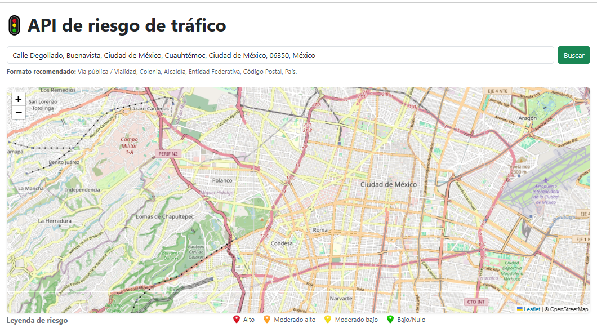
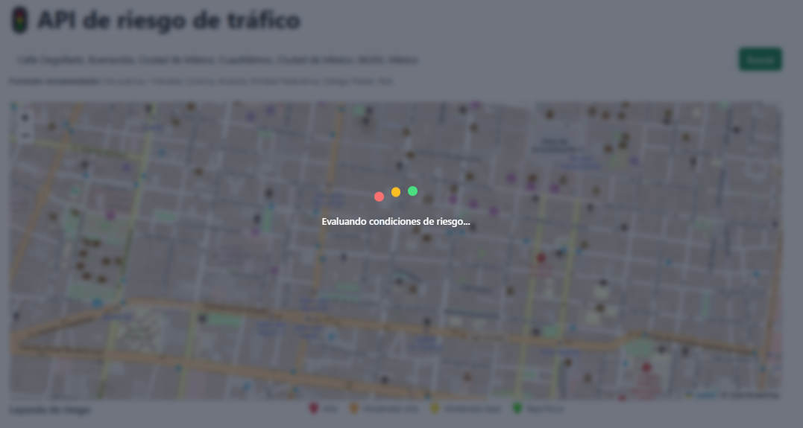
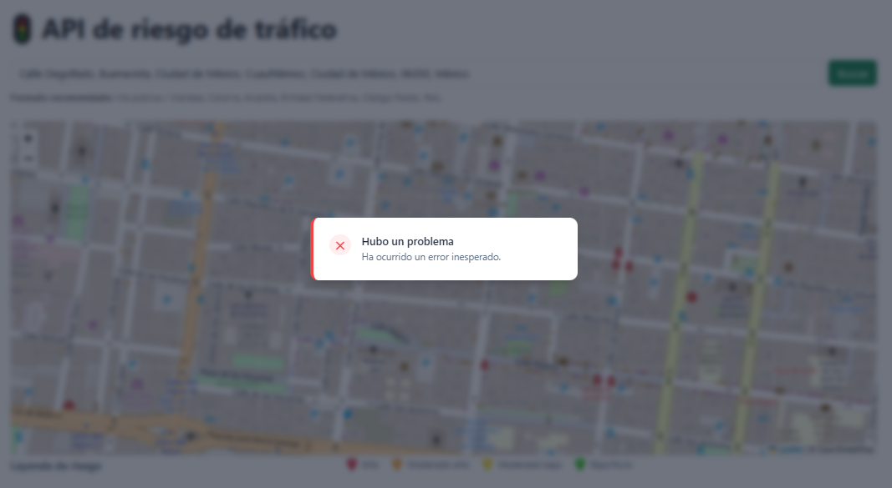
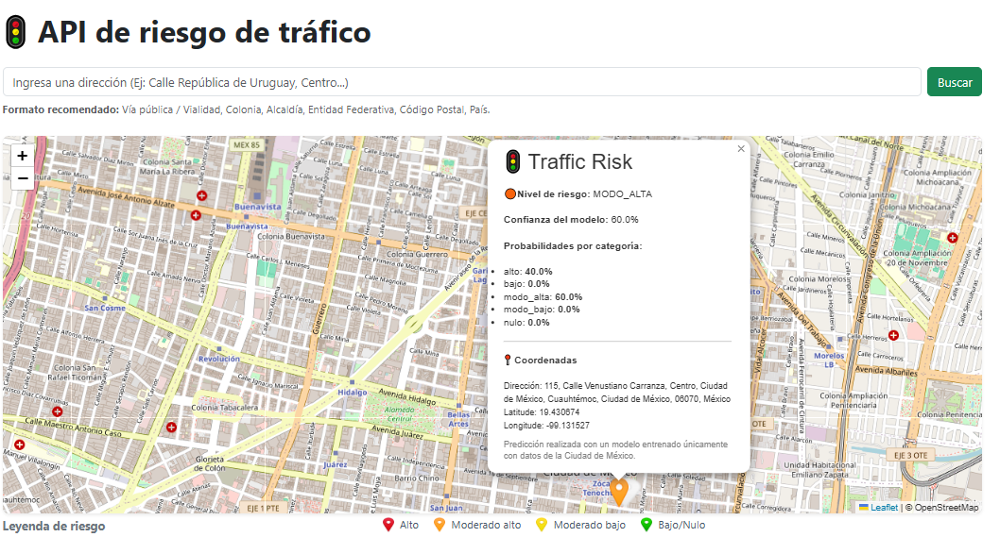

## Traffic Risk API

    

## Descripción del proyecto

    Traffic Risk API es una aplicación web diseñada para predecir el nivel de riesgo de congestión vehicular y peatonal en un punto específico de la Ciudad de México.

    La aplicación permite realizar consultas mediante un mapa interactivo o a través de una búsqueda por dirección. Una vez recibida la ubicación, la API analiza las coordenadas utilizando un modelo de Machine Learning basado en K-Nearest Neighbors (KNN), entrenado con datos históricos de Waze, para clasificar el nivel de riesgo en una de cinco categorías:

    🔴 Alto
    🟠 Moderado Alto
    🟡 Moderado Bajo
    🟢 Bajo y Nulo

    Además de la clasificación del riesgo, la aplicación muestra la dirección correspondiente, las coordenadas, el nivel de confianza de la predicción y la probabilidad asociada a cada categoría.

# Capturas 

    
    
    

## Características

✔ Predicción de riesgo mediante Machine Learning

✔ Búsqueda por dirección

✔ Mapa interactivo con Leaflet

✔ Marcadores dinámicos según el nivel de riesgo

✔ Indicador de carga

✔ Manejo de errores

✔ Diseño responsive

✔ Docker

✔ Docker Compose

✔ Documentación Swagger

## Problema que resuelve

    El tráfico en la Ciudad de México puede variar considerablemente dependiendo de la zona y la hora del día, dificultando la planeación de recorridos.

    Traffic Risk API proporciona una estimación del nivel de congestión en una ubicación específica, permitiendo que el usuario conozca anticipadamente el posible riesgo de tráfico y tome mejores decisiones sobre sus desplazamientos.

## Arquitectura:
    Usuario
      │
      ▼
    Frontend (HTML, CSS, JavaScript)
        │
        ▼
    FastAPI
        │
        ├──────────────► GeocodingService
        │                     │
        │                     ▼
        │               Nominatim API
        │
        ▼
    TrafficService
        │
        ▼
    PredictionEngine
        │
        ▼
    Modelo KNN (.pkl)

    La aplicación sigue una arquitectura en capas donde el frontend interactúa con FastAPI mediante peticiones HTTP. FastAPI delega la lógica de negocio a los servicios correspondientes. TrafficService prepara los datos para el modelo de Machine Learning y GeocodingService obtiene la información geográfica mediante Nominatim.

## Tecnologías utilizadas:
    | Tecnología        | Uso                                              |
    |-------------------|--------------------------------------------------|
    | FastAPI           | Desarrollo de la API REST                        |
    | HTML5             | Interfaz de usuario                              |
    | CSS3              | Diseño responsive                                |
    | JavaScript        | Consumo de la API e interacción con la interfaz  |
    | Leaflet           | Visualización del mapa interactivo               |
    | Scikit-Learn      | Modelo de Machine Learning                       |
    | Nominatim         | Geocodificación de direcciones                   |
    | Docker            | Contenerización de la aplicación                 |
    | Docker Compose    | Orquestación del entorno                         |
    | Git               | Control de versiones                             |

## Flujo de funcionamiento:
    1.- El usuario selecciona una ubicación mediante el mapa o una dirección.
    2.- app.js recibe la solicitud y la envía a FastAPI mediante api.js.
    3.- FastAPI identifica el endpoint solicitado y delega la lógica a TrafficService.
    4.- TrafficService consulta el modelo KNN para obtener la predicción y solicita la información geográfica a GeocodingService.
    5.- GeocodingService consulta la API de Nominatim para obtener la dirección correspondiente.
    6.- FastAPI devuelve la respuesta al frontend.
    7.- El frontend muestra el marcador, el nivel de riesgo y la información adicional al usuario.

## Instalación:
    docker compose up --build

## Endpoints:
    | Método | Endpoint        | Descripción                     |
    | ------ | --------------- | ------------------------------- |
    | POST   | /api/v1/risk    | Predicción mediante coordenadas |
    | POST   | /api/v1/address | Predicción mediante dirección   |
    | GET    | /docs           | Documentación Swagger           |

## Entrenamiento:
    El modelo fue entrenado con un muestreo de los datos obtenidos de la api de waze del año 2019 de toda la zona de la CDMX. El modelo KNN (K-Nearest Neighbors) fue seleccionado como el que obtuvo el mejor desempeño en una evaluacion con diferentes modelos de clasificacion, obteniendo un precisión promedio del 89 %, los datos se pueden observar en el archivo app/artifacts/MetadataBuilder.json

